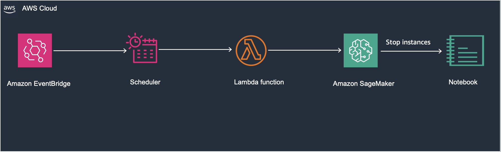

# Auto-Stop InService Sagemaker Notebook Instances in an AWS account.


Important: this application uses various AWS services and there are costs associated with these services after the Free Tier usage - please see the [AWS Pricing page](https://aws.amazon.com/pricing/) for details. You are responsible for any AWS costs incurred. No warranty is implied in this example.


Sagemaker-stop-instances.yaml - **Cloudformation template to provision the resources required**

In an AWS environment where efficient resource utilization and cost optimization are paramount , automating the management of Amazon SageMaker notebook instances is crucial. 
To prevent overspending and overutilization of AWS resources, 
an automated solution is designed using AWS EventBridge , AWS Lambda and Amazon SageMaker Services. 

## Solution Overview

The solution aims to create an automated process that stops Amazon SageMaker notebook instances during specific scheduled times when they are not actively needed. 
This is achieved by scheduling an AWS Eventbridge rule to trigger an AWS lambda function. The Lambda function then lists all the SageMaker notebook instances 
with the **"InService"** status and stops them ensuring that the resources are efficiently managed and costs are minimized. 

Note : **Architecture Diagram**



# Requirements

You need to deploy the Cloudformation stack Sagmaker-stop-instances.yaml in your AWS account.

## Steps
1. Sign into the **AWS Management Console** at <a href="https://console.aws.amazon.com/">https://console.aws.amazon.com/</a>
2. In the upper-right corner of the AWS Management Console, confirm you are in the desired AWS region. For this workshop we will use the **US East (N. Virginia)** [us-east-1]
3. Install or update the latest version of the AWS CLI <a href="https://docs.aws.amazon.com/cli/latest/userguide/getting-started-install.html">https://docs.aws.amazon.com/cli/latest/userguide/getting-started-install.html/</a>

4. Deploy the cloudformation stack in the AWS region of your choice using the following command in the [AWS CLI](https://aws.amazon.com/cli/). You need to provide the values for the parameters lambda role name and cron expression for the scheduled eventbridge rule. 

**Define the parameter values**

StackName=**'Sagemaker-stop-instances'**
LambdaRoleName=**'REPLACE ME'** (pass the lambda role name)
ScheduledTime=**'REPLACE ME'** (pass the cron expression)

**Deploy Cloudformation Template**
```bash
  aws cloudformation deploy \
    --template-file Sagemaker-stop-instances.yaml \
    --stack-name ${StackName} \
    --parameter-overrides \
        "LambdaRoleName=${LambdaRoleName}" \
        "ScheduledTime=${ScheduledTime}" \
    --capabilities CAPABILITY_NAMED_IAM CAPABILITY_AUTO_EXPAND

```
==============================================

Copyright 2021 Amazon.com, Inc. or its affiliates. All Rights Reserved.

SPDX-License-Identifier: MIT-0
